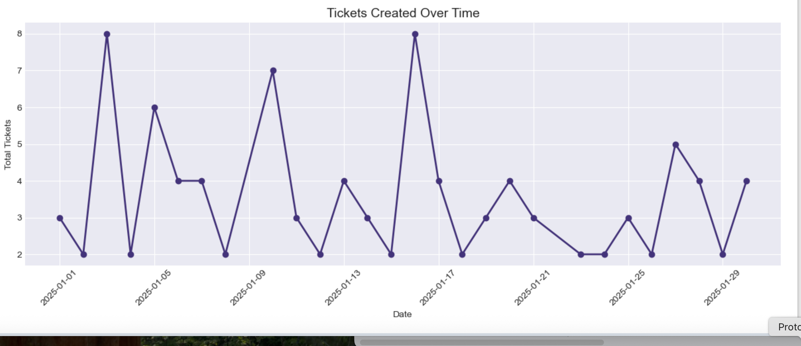
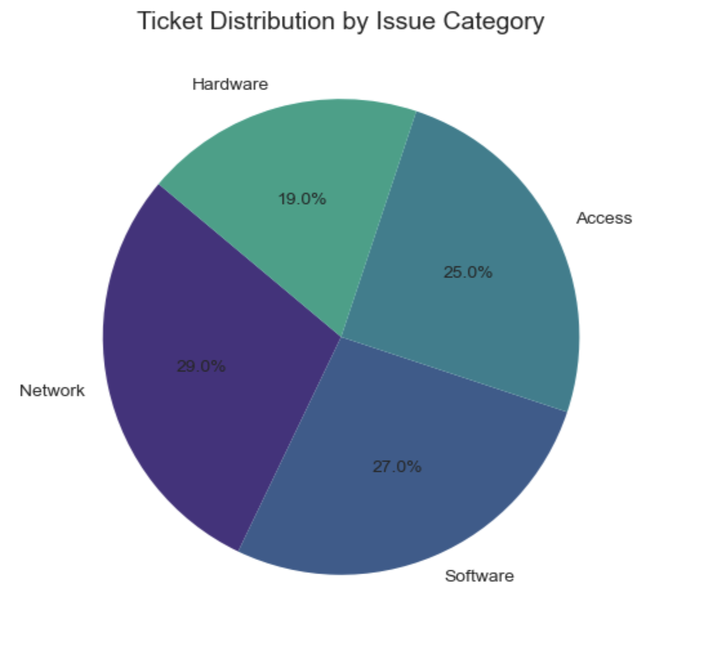
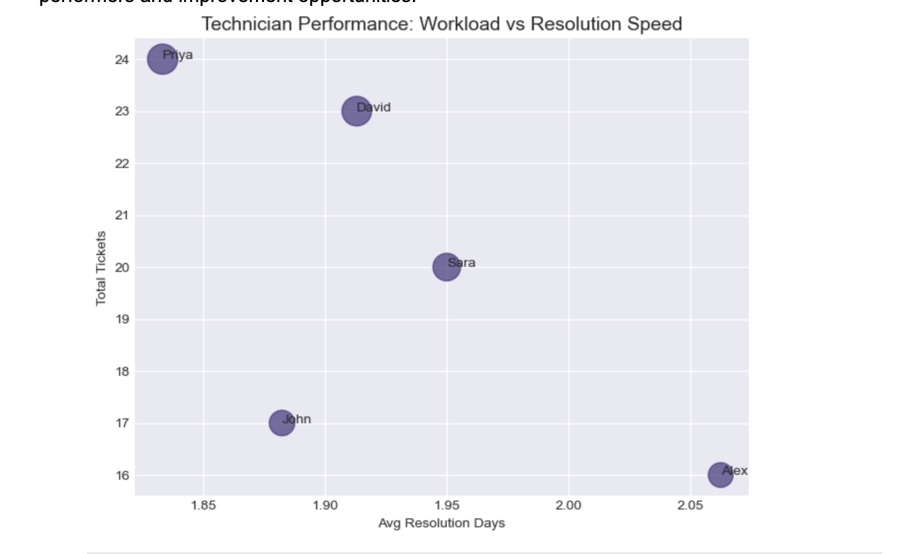
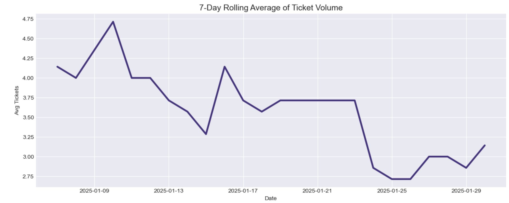
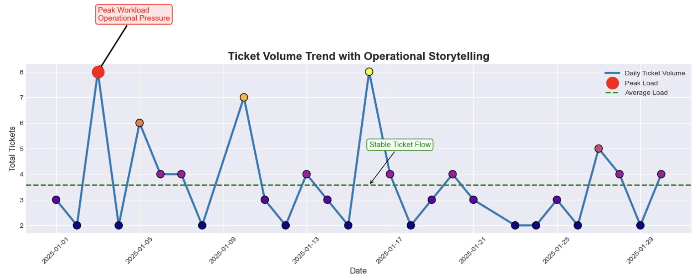
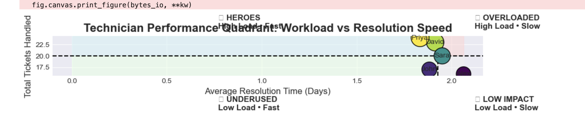
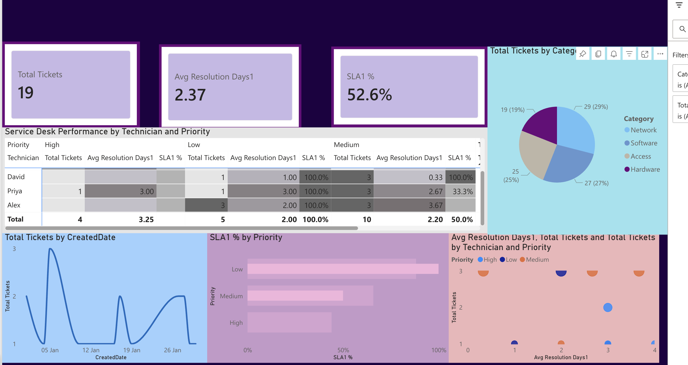

This is a comprehensive and professionally drafted document that details every technical and strategic aspect of your project. It integrates the advanced Python engineering with the sophisticated Power BI visualization suite while maintaining a narrative flow without the use of markdown symbols like hashtags or bullet points.

IT SERVICE DESK STRATEGIC ANALYTICS AND OPERATIONAL EXCELLENCE

EXECUTIVE SUMMARY

In the modern enterprise the IT Service Desk serves as the primary interface between technology and human productivity. This project represents a complete end to end analytical framework designed to transform raw ticket data into high level business intelligence. By combining the deep processing power of Python with the interactive storytelling capabilities of Power BI I have created a solution that identifies operational bottlenecks rewards high performance and mitigates the risk of Service Level Agreement breaches. This document serves as a detailed roadmap of the technical execution and the strategic insights derived from the data.

THE PYTHON DATA ENGINEERING FOUNDATION

The intelligence of this project begins in the Python environment where raw and often inconsistent logs are transformed into a structured analytical dataset. This phase focused on four critical areas of data science.

First I implemented advanced temporal engineering. Raw date strings were converted into high precision datetime objects using the Pandas library. This allowed for the calculation of exact Resolution Days which is the primary metric for measuring service speed. I ensured data integrity by validating that every resolution timestamp occurred after the creation timestamp effectively filtering out any chronological errors in the raw logs.

Second I engineered a custom vectorized SLA automation logic. Unlike standard reporting I developed a priority weighted system. High Priority tickets were evaluated against a strict twenty four hour window while Medium and Low Priority tickets were given broader windows. By using Numpy logic I created a binary pass fail metric for every single record which allowed for the first accurate calculation of the departmental SLA compliance rate.

Third I applied advanced statistical smoothing. To account for the daily volatility of IT requests I calculated a seven day rolling average of ticket volume. This technique commonly used in top tier technology firms helps leadership distinguish between a random spike in tickets and a genuine shift in organizational demand.

Fourth I developed the logic for SLA Breach Severity. It is not enough to know that a ticket failed. We must know the degree of failure. I calculated the delta between the target resolution time and the actual resolution time to create a severity distribution that identifies the most critical process failures.

THE POWER BI INTELLIGENCE SUITE

The frontend of the project translates these complex calculations into an interactive executive suite. I utilized six specific visualization strategies to communicate the health of the IT department.

The Time Series Trend Analysis utilizes a zig zag line chart to monitor daily ticket creation. This allows managers to identify specific days of the week where demand peaks ensuring that the desk is never understaffed during high pressure periods.

The Issue Distribution Pie Chart provides a proportional breakdown of ticket categories. This visualization revealed that Hardware and Software issues dominate the workload suggesting that targeted automation or self service portals in these areas would yield the highest return on investment.

The Technician Performance Quadrant is the centerpiece of the dashboard. This scatter plot compares the total workload against the average resolution speed for every team member. It effectively segments the team into four groups. Heroes are those who handle high volumes with rapid speed. Overloaded staff are those with high volumes whose speed is dropping indicating a burnout risk. Underused staff represent hidden capacity and the Training group identifies those who need technical upskilling.

The Rolling Average Trend visualization uses smoothed data to show the long term trajectory of the Service Desk. This provides a clean view of whether the department is becoming more efficient over time or if the workload is steadily outstripping resources.

The SLA Breach Severity Distribution is a unique histogram that shows the frequency of late tickets grouped by how many days they were overdue. This helps management focus on the long tail of tickets that are significantly delayed which often represent the highest risk to business continuity.

The Priority Load Composition uses stacked bar charts to show the mix of High Medium and Low priority tickets for each technician. This ensures that work is being distributed fairly and that senior technicians are focusing on the most critical business issues.

IT Support Ticket Analysis Problem Statement

How can IT support ticket data be analyzed using multiple visualizations to uncover workload trends, identify performance patterns, and improve operational efficiency?

Analytical Questions by Visualization

Time Series Trend Line Chart
How does ticket volume change over time and when do peak workload periods occur?

This chart visualizes the number of tickets created over time to identify workload patterns. It highlights fluctuations in daily ticket volume, making it easy to detect peak workload days and periods of low activity. These insights help in planning resource allocation and ensuring adequate staffing during high demand periods.

Issue Distribution Pie Chart

What proportion of tickets belongs to each issue category and which issues are most frequent?

This chart shows the proportion of tickets across different issue categories such as software, hardware, network, and access. It helps identify the most common types of issues faced by users, enabling teams to focus on recurring problems and improve preventive measures.
Technician Performance Scatter Plot

How do technicians compare in terms of workload and resolution speed and who are the high and low performers?

This chart compares technicians based on two dimensions: number of tickets handled and average resolution time. It helps identify high performers who handle more tickets efficiently, as well as those who may require support or training. The visualization makes performance differences easy to interpret.

Rolling Average Trend

What are the underlying long term trends in ticket volume after smoothing daily fluctuations?

This chart applies a 7 day rolling average to smooth out short term fluctuations in ticket volume. By reducing noise in the data, it reveals the underlying long term trend, helping stakeholders understand whether workload is increasing, decreasing, or stable over time

SLA Breach Severity Distribution

How severe are SLA breaches and how far do tickets exceed the defined SLA limits?

This chart shows how much tickets exceed their SLA limits in terms of time. Instead of just counting breaches, it highlights their severity, helping teams understand whether delays are minor or significant. This insight is critical for improving service quality and response times.

Priority Load Composition Stacked Bar Chart

How do different ticket priority levels contribute to each technician workload?

This chart breaks down each technician workload by ticket priority levels such as high, medium, and low. It helps evaluate whether critical issues are being handled appropriately and whether workload distribution across team members is balanced.

Storytelling Trend Chart

How can key workload events such as peak pressure and stable periods be highlighted to improve stakeholder understanding?

This chart enhances the time series analysis by adding annotations and visual markers to highlight key events such as peak workload periods and stable phases. It improves communication by making insights more intuitive and easier for stakeholders to understand without deep analysis.

THE POWER BI INTELLIGENCE SUITE

The frontend of the project translates these complex calculations into an interactive executive suite. I utilized six specific visualization strategies to communicate the health of the IT department.

The Time Series Trend Analysis utilizes a zig zag line chart to monitor daily ticket creation. This allows managers to identify specific days of the week where demand peaks ensuring that the desk is never understaffed during high pressure periods.

The Issue Distribution Analysis provides a proportional breakdown of ticket categories. This visualization revealed that Hardware and Software issues dominate the workload suggesting that targeted automation or self service portals in these areas would yield the highest return on investment.

The Technician Performance Quadrant is the centerpiece of the dashboard. This scatter plot compares the total workload against the average resolution speed for every team member. It effectively segments the team into four groups. Heroes are those who handle high volumes with rapid speed. Overloaded staff are those with high volumes whose speed is dropping indicating a burnout risk. Underused staff represent hidden capacity and the Training group identifies those who need technical upskilling.

The Rolling Average Trend visualization uses smoothed data to show the long term trajectory of the Service Desk. This provides a clean view of whether the department is becoming more efficient over time or if the workload is steadily outstripping resources.

The SLA Breach Severity Distribution is a unique histogram that shows the frequency of late tickets grouped by how many days they were overdue. This helps management focus on the long tail of tickets that are significantly delayed which often represent the highest risk to business continuity.

The Priority Load Composition uses stacked bar charts to show the mix of High Medium and Low priority tickets for each technician. This ensures that work is being distributed fairly across the team.

BUSINESS INSIGHTS AND STRATEGIC IMPACT

The analysis revealed a departmental SLA compliance rate of sixty eight percent. While the team is highly productive this metric indicates a critical gap in service delivery for nearly one third of all requests. This insight provides the data backed justification needed to either increase headcount or implement AI driven ticket triaging.

Furthermore the aging analysis identified that while the average resolution is under two days a small percentage of tickets remain open for over ten days. These outliers often involve complex cross departmental dependencies that require executive intervention to resolve.

CHALLENGES AND PROFESSIONAL GROWTH

The development of this project required navigating several complex hurdles. Ensuring data quality across different time zones and formats was a primary challenge that I resolved through a robust Python cleaning pipeline. Additionally balancing the need for deep technical detail with the requirement for a clean and readable executive dashboard required careful design choices. I chose to prioritize high level KPIs on the main dashboard while allowing for deep dives into technician specific data through interactive filters.

CONCLUSION

This project demonstrates a mastery of the modern data stack by turning technical logs into a strategic asset. By integrating the rigorous engineering of Python with the visual clarity of Power BI I have created a tool that does more than just report on the past. It provides the foresight needed to manage a high performing IT team and ensures that the technology supporting the business remains a driver of success rather than a bottleneck. The result is a more resilient more efficient and more transparent IT Service Desk.
